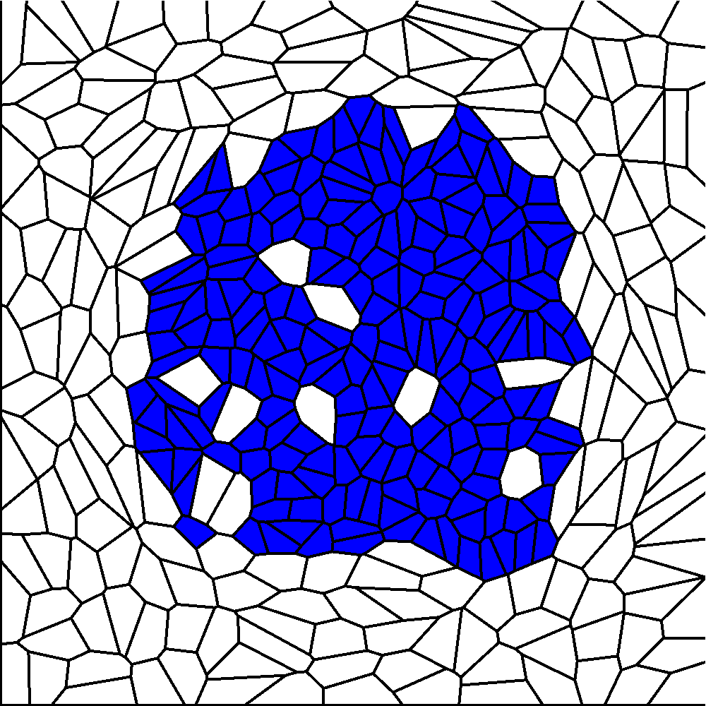

This set of labs covered Voronoi diagrams, Power Diagrams, semi-optimal transport, and simulating fluid dynamics using a mix of the previous labs. You can see a gif of the fluid simulations done in Lab 8 right here:

